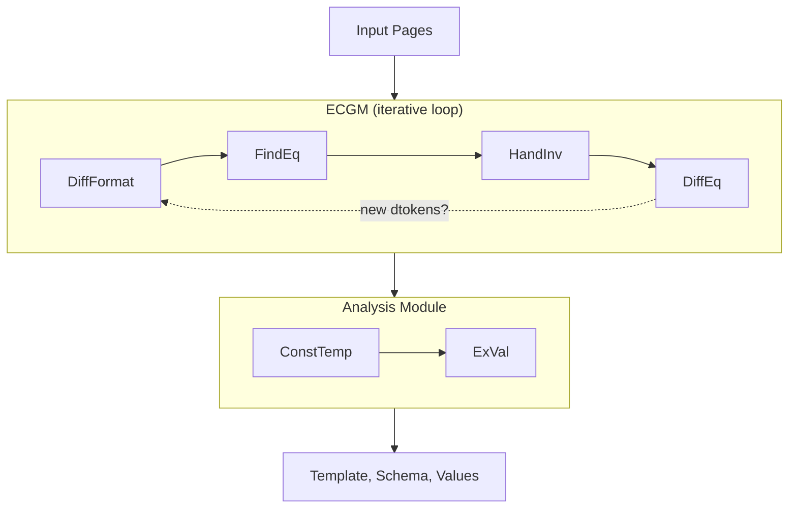

import AlgorithmDemo from '@site/src/components/AlgorithmDemo';
import UFREView from '@site/src/components/UFREView';
import ExalgPhaseViz from '@site/src/components/ExalgPhaseViz';

{/* Normalize ExAlg result data to UFREView format:
    "set" -> "repeat", "body" -> "elements" */}
export function normalizeExalgStep(step) {
  if (step.phase === 'result' && step.data.elements) {
    function convert(elem) {
      if (elem.type === 'set') {
        return { type: 'repeat', var_name: elem.var_name, elements: (elem.body || []).map(convert) };
      }
      if (elem.type === 'optional') {
        return { ...elem, elements: (elem.elements || []).map(convert) };
      }
      return elem;
    }
    return { ...step, data: { ...step.data, ufre: step.data.elements.map(convert) } };
  }
  return step;
}

export const renderExalg = (step, idx, all) => {
  const normalized = all.map(normalizeExalgStep);
  const normStep = normalizeExalgStep(step);
  return (
    <div>
      <ExalgPhaseViz step={normStep} allSteps={normalized} currentIndex={idx} />
      <UFREView step={normStep} allSteps={normalized} currentIndex={idx} />
    </div>
  );
};

# ExAlg: Equivalence Classes from Token Frequency

ExAlg (Arasu & Garcia-Molina, SIGMOD 2003) infers templates from collections of web pages by analyzing **token frequency patterns**. Unlike tree-based algorithms, ExAlg works on **linearized token streams** and discovers template structure from **occurrence vectors** -- grouping tokens into equivalence classes that correspond to the type constructors of the unknown schema.

> **Reference:** Arasu, A. and Garcia-Molina, H. "Extracting Structured Data from Web Pages." *SIGMOD 2003*, pp. 337--348.

## Key Insight

The paper's central observation (Observation 4.2) is that tokens associated with the same type constructor in the unknown template tend to occur in the same equivalence class -- a maximal set of tokens sharing the same occurrence-frequency vector across all input pages. An equivalence class of large size and high support (present in many pages) is called an **LFEQ** (Large and Frequently occurring EQuivalence class). LFEQs are unlikely to form by chance and almost always correspond to a single type constructor.

## Architecture Overview

ExAlg has two stages (Figure 10 in the paper):

1. **ECGM** (Equivalence Class Generation Module) -- discovers sets of tokens associated with the same type constructor. Four sub-modules iterate in a loop:
   - **DiffFormat** -- differentiates token roles using occurrence-path context (Observation 4.4)
   - **FindEq** -- computes occurrence vectors, forms equivalence classes, filters to LFEQs
   - **HandInv** -- validates ordering and nesting properties, discards invalid LFEQs
   - **DiffEq** -- further differentiates tokens within valid EQ class spans (Observation 4.5)

2. **Analysis** -- uses the LFEQs to build a template and extract values:
   - **ConstTemp** -- recursively constructs the template from ordered, nested LFEQs using PosString patterns
   - **ExVal** -- extracts data values from pages using the template



## Formal Definitions

### Tokens and Linearization

A **token** is a word or HTML tag. Our implementation linearizes each DOM tree into a flat token stream where each token carries:

- **kind** -- `open`, `close`, `text`, `tail`, or `attr`
- **tag** -- the element's tag name
- **value** -- text content or attribute value
- **position_key** -- DOM path like `"0/1/text"` (for harness output)
- **context** -- tag-path like `"div/h1"` (for DiffFormat grouping)

Structural tokens (`open`/`close`) mark element boundaries. Value tokens (`text`/`tail`/`attr`) carry the actual content that gets classified as fixed or variable.

### Occurrence Vectors and Equivalence Classes

**Definition 4.1** (Occurrence Vector): The occurrence vector of a token *t* is the tuple *(f_1, ..., f_n)* where *f_i* is the number of occurrences of *t* in page *p_i*.

**Definition 4.2** (Equivalence Class): An equivalence class is a maximal set of tokens having the same occurrence vector.

In our implementation, the "token identity" for frequency counting is the tuple `(kind, tag, attr_name, context)` -- we call this the **structural key with context**. Two tokens with the same structural key and context are considered the same token for the purpose of occurrence vectors.

**Observation 4.2** (LFEQs are meaningful): An equivalence class of large size and support is usually valid -- meaning its tokens are associated with the same type constructor. This is because two different type constructors rarely produce the same frequency vector across many pages.

### Ordered and Nested Equivalence Classes

**Definition 4.3** (Ordered): An equivalence class is ordered if its tokens can be consistently ordered such that for every page, the *l*-th occurrence of token *t_j* always appears before the *l*-th occurrence of token *t_k* (when j < k).

**Definition 4.4** (Nested): Two equivalence classes are nested if either their spans never overlap, or the span of one always falls within a fixed position of the other.

**Observation 4.3**: Valid equivalence classes are ordered, and pairs of valid classes are nested. These properties let ConstTemp recursively decompose the template.

## ECGM Sub-Modules

### DiffFormat: Occurrence-Path Differentiation (Section 4.3, Obs. 4.4)

**Observation 4.4**: Two page-tokens with different occurrence-paths (paths from root in the parse tree) have different roles.

The paper's DiffFormat differentiates tokens by their occurrence-path in the HTML parse tree. A token like `<b>` appearing under `<body>` plays a different role from `<b>` appearing under `<ol>/<li>`.

**Our implementation** uses a two-pass **context refinement** approximation:

1. **Initial pass**: Each token gets a tag-path context during linearization (e.g., `"div/table/tr/td"`). This serves as the occurrence-path analog.

2. **Refinement pass** (`_refine_contexts`): When a template-constant element appears N > 1 times per page (e.g., two `<tbody>` children of the same `<table>`), all descendants initially share the same context. The refinement adds sibling indices: `"table/tbody#0/tr"` vs. `"table/tbody#1/tr"`, allowing frequency analysis to distinguish them.

Only elements classified as template constants with fixed count > 1 are indexed -- loop-varying parents have unstable sibling positions and are left unindexed.

This approximation captures the essential discrimination from Observation 4.4 without implementing the full iterative occurrence-path computation. The trade-off is that tokens differentiated only by their position within an equivalence class span (rather than by their tree path) require DiffEq to handle.

### FindEq: Equivalence Class Discovery

FindEq computes occurrence vectors for every structural-key-with-context tuple and groups tokens into equivalence classes. It then filters to retain only LFEQs -- classes exceeding the **SizeThres** and **SupThres** parameters.

Our implementation classifies structural keys into three categories based on their occurrence vector:

| Vector pattern | Classification | Example |
|---|---|---|
| `(1, 1, ..., 1)` | **Template constant** -- appears exactly once per page | `<html>`, `<body>`, fixed headings |
| `(k, k, ..., k)` where k > 1 | **Template constant** -- fixed count > 1 | Two `<tbody>` elements per page |
| All > 0 but varying | **Loop marker** -- repeated content | `<li>` elements (3 in page 1, 5 in page 2) |
| Some zeros | **Optional marker** -- absent from some pages | Conditional sidebar |

### HandInv: Invalid Equivalence Class Handling (Section 4.2)

HandInv detects and removes invalid LFEQs -- those that are not properly ordered or nested. In practice, invalid LFEQs are typically either not ordered or not nested with respect to other LFEQs.

**Our implementation**: A template-key token physically inside a loop element (between a loop-key `open` and its matching `close`) has a coincidental `(1, 1, ..., 1)` vector. For example, if every loop iteration contains a `class="item"` attribute, it appears once per page but is actually loop-body content, not a skeleton constant.

HandInv scans each page's token stream, tracking loop depth. Any template-key token found at depth > 0 inside a loop element is **demoted** from the skeleton:

```python
# Simplified HandInv logic
for each token in stream:
    if token opens a loop element: depth += 1
    if token closes a loop element: depth -= 1
    if token is in template_keys and depth > 0:
        demote token  # not a true skeleton constant
```

This corresponds to the paper's detection of EQ class members that violate nesting properties -- they are "inside the span of" a loop EQ class but were incorrectly placed in the template-constant class.

### DiffEq: Positional Differentiation (Section 4.3, Obs. 4.5)

**Observation 4.5**: Within the span of an equivalence class, tokens at a fixed position Pos(*p*) play a different role from tokens at other positions or outside the span entirely.

The paper's DiffEq further differentiates tokens that share a structural key but play different roles -- for instance, a fixed header `<b>` tag and the repeated `<b>` tags within loop iterations.

**Our implementation** applies a specific case of this: when a loop-key element group has the same value in its **first instance** across all pages but different values in later instances, the first instance is a template constant (e.g., a header row) and the rest are loop body data. The first instance of all tokens in that element group is **promoted** to the skeleton.

Two guards prevent incorrect promotions:

1. **Min-count guard**: Only promote when every page has at least 2 instances of the loop element. If the minimum count is 1, the "first instance" is the sole loop iteration and cannot be distinguished from loop data.

2. **Nesting guard**: Skip promotion for elements nested inside another loop element (e.g., `<option>` inside a loop `<optgroup>`). Only top-level loop elements are eligible.

```python
# Simplified DiffEq logic
for each loop-key context group:
    if nested inside another loop element: skip
    if min instance count < 2: skip
    if first instance has same value in all pages
       AND later instances differ:
        promote first instance to skeleton
```

## ConstTemp: Template Construction (Section 5.2)

Once ECGM has produced a set of ordered, nested LFEQs, ConstTemp recursively builds the template.

### Skeleton and Gaps

The skeleton consists of all tokens classified as template constants (after HandInv demotion and DiffEq promotion). These tokens appear in the same order in every page and form the fixed "frame" of the template.

Between consecutive skeleton tokens are **gaps** -- regions that may contain loops, optionals, or variables. ConstTemp analyzes each gap independently.

### PosString Patterns (Table 1)

For each non-empty position *p* of an ordered equivalence class, ConstTemp examines the **PosString** -- the string of tokens and nested EQ class symbols that appear at that position. The PosString pattern determines the sub-template type:

| # | Pattern | Template type | Description |
|---|---|---|---|
| 1 | E_j E_j ... | Set(T_Ej) | Set (zero or more occurrences of nested EQ class) |
| 2 | E_j S E_j S ... E_j | Set(T_Ej, sep=S) | Set with separator S |
| 3 | E_j or E_k | T_Ej or T_Ek | Disjunction (one of two EQ classes) |
| 4 | epsilon or E_j | Optional(T_Ej) | Optional (EQ class or empty) |
| 5 | string of dtokens and empty EQ classes | T_B | Basic type (literal or variable) |
| 6 | Unknown | T_B | Fallback to basic type |

Our implementation maps these patterns to the four template element types:

- **Pattern 1-2** produce `Set` elements (repeating content with optional separators)
- **Pattern 3** produces disjunctions (not yet implemented -- falls back to `Optional`)
- **Pattern 4** produces `Optional` elements
- **Pattern 5-6** produce `Literal` or `Var` elements depending on value consistency

### Gap Analysis

Our gap analysis (`_analyze_gap`) determines the template construct for each gap:

1. **All empty** -- skip (no content between these skeleton tokens)
2. **Some empty, some non-empty** -- `Optional` (content present in some pages) or `Set` (if varying non-zero counts detected)
3. **Varying non-zero counts** -- decompose by tag type, producing per-tag `Set` or fixed elements
4. **Same count, same structure** -- build fixed template comparing values token-by-token
5. **Same count, different structure** -- PosString analysis using LCS-based backbone to find common element ordering, then recurse on sub-gaps

## Template Element Types

The implementation uses four template element types that correspond to the paper's type constructors:

| Element | Paper concept | Description |
|---|---|---|
| `Literal` | Template token | Fixed content that must match exactly |
| `Var` | Value token (basic type *B*) | Variable data position -- extracts a value |
| `Set` | Set type constructor `{T}` | Repeating pattern (loop). Body matches 0+ times |
| `Optional` | Optional type `(T)?` | Content present in some pages but not others |

Each `Var` has an `always_has_value` flag indicating whether the position is non-empty in every training page. `Set` elements contain a body template that matches each iteration, plus a `var_name` for the extracted list.

## Connection Between Paper and Implementation

| Paper module | Implementation function | Key difference |
|---|---|---|
| Linearization | `_linearize()`, `_linearize_elem()` | Adds `context` (tag-path) and `position_key` per token |
| DiffFormat (Obs 4.4) | `_refine_contexts()` | Two-pass approximation instead of full occurrence-path iteration |
| FindEq | `_structural_key_vector()`, `_classify_structural_keys()` | Uses hard-coded vector pattern rules instead of SizeThres/SupThres parameters |
| HandInv | Loop-depth scan in `_build_template()` | Demotes skeleton tokens nested inside loop elements |
| DiffEq (Obs 4.5) | First-instance promotion in `_build_template()` | Min-count and nesting guards instead of full span-position analysis |
| ConstTemp (Sec 5.2) | `_build_template()` skeleton/gap, `_analyze_gap()`, `_analyze_gap_posstring()` | LCS-based backbone instead of full PosString algebra |
| ExVal | `_match_extract()`, `_match_mask()` | Forward scan matching against linearized template |
| ECGM iteration | Single pass through DiffFormat -> FindEq -> HandInv -> DiffEq | Paper iterates until convergence; we do one pass |

### Notable Simplifications

1. **No iterative ECGM loop**: The paper runs DiffFormat -> FindEq -> HandInv -> DiffEq in a loop until no new dtokens are formed. Our implementation runs a single pass, which suffices for the fixed-structure templates in the test suite.

2. **Context as occurrence-path proxy**: The paper computes full occurrence-paths from root to each token in the parse tree. We approximate this with tag-path contexts (e.g., `"div/table/tr/td"`), refined with sibling indices where ambiguous.

3. **Pattern matching instead of SizeThres/SupThres**: The paper uses size and support thresholds to filter equivalence classes. We classify directly from vector patterns: `(1,...,1)` is a template constant, varying-but-positive is a loop, contains-zero is optional.

4. **LCS-based gap analysis instead of PosString algebra**: The paper's ConstTemp uses a formal PosString pattern table (Table 1). We use LCS backbone computation and recursive gap decomposition to achieve the same structural inference.

## Interactive Demo

<AlgorithmDemo
  algorithm="exalg"
  renderViz={renderExalg}
  phaseLabels={{
    tokenization: "Tokenize",
    equivalence_classes: "FindEq",
    diffformat: "DiffFormat",
    handinv: "HandInv",
    diffeq: "DiffEq",
    skeleton: "Skeleton",
    result: "Result",
  }}
  defaultPages={[
    '<div><h1>Products</h1><p class="item">Widget - $9.99</p></div>',
    '<div><h1>Products</h1><p class="item">Sprocket - $4.99</p><p class="item">Doodad - $4</p></div>',
    '<div><h1>Products</h1><p class="item">Gizmo - $14.99</p><p class="item">Gadget - $19.99</p><p class="item">Thingamajig - $24.99</p></div>',
  ]}
/>

The trace steps correspond to the ECGM sub-modules and ConstTemp:

1. **Tokenize** -- Linearize each page into a token stream with structural keys and tag-path contexts
2. **FindEq** -- Compute occurrence vectors, form equivalence classes, classify as template/loop/optional
3. **DiffFormat** -- Refine contexts for fixed-count sibling disambiguation (shown when refinement changes any keys)
4. **HandInv** -- Demote skeleton tokens nested inside loop bodies (shown when any tokens are demoted)
5. **DiffEq** -- Promote first instances of loop elements with fixed values (shown when any tokens are promoted)
6. **Skeleton** -- Extract skeleton tokens and gap regions from each page
7. **Result** -- Final inferred template with Literal, Var, Set, and Optional elements

## Strengths and Limitations

**Strengths:**
- Works on linearized tokens -- no tree alignment needed
- Handles loops (Sets) and optionals from frequency patterns alone
- Theoretically grounded: LFEQs correspond to type constructors (Observation 4.2)
- Order-independent: result doesn't depend on page ordering
- Graceful degradation: when assumptions are violated, impact is localized to affected attributes (Section 6.3)

**Limitations:**
- Requires large enough input that type constructors appear more than SizeThres times (Assumption A2)
- Tokens in template must have unique roles for LFEQ formation (Assumption A1)
- No support for disjunctions (the paper's `(T_1 | T_2)` type) -- we fall back to Optional
- Single-pass ECGM may miss differentiations that the paper's iterative loop would catch
- Cannot handle cases where encoded data has "regularity" that creates spurious EQ classes (Assumption A3)

## Source Code

The implementation is in [`westlean/algorithms/exalg.py`](https://github.com/freelawproject/westlean/blob/main/westlean/algorithms/exalg.py) (~1075 lines). The tracing variant is in [`westlean/algorithms/tracing_exalg.py`](https://github.com/freelawproject/westlean/blob/main/westlean/algorithms/tracing_exalg.py).
